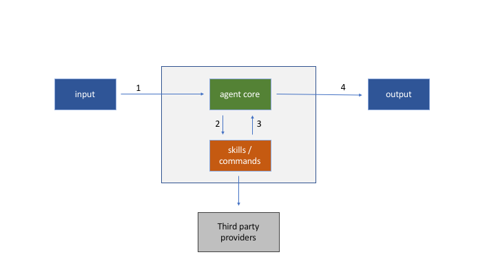

# goagent - Golang Agent Platform

[goagent](https://github.com/enriquebris/goiagent) is a platform to manage agents.

## Features

- Multiple [input / outputs](#input--output)
- Extensible [commands / skills](#commands--skills)
    - Unlimited [nested subcommands](#nested-subcommands)
    - [Security by adding configurable restrictions](#security-by-restrictions)
    - [Parameters](#parameters)
        - [Type checking](#type-checking)
        
        
## Get started

Inline-style: 


### Skill example

```go
package example

import (
	"github.com/enriquebris/goagent/cmd"
	"github.com/enriquebris/goagent/handler"
	botio "github.com/enriquebris/goagent/io"
	"github.com/enriquebris/goagent/message"
)

func GetMainCMD(commonHandler *handler.Common) cmd.CMD {
	return cmd.CMD{
		PatternType:  cmd.CMDTypeWord,
		Pattern:      []string{"example"},
		Description:  "Example command",
		Handler:      defaultHandler,
		HandlerError: commonHandler.GetErrorHandler([]string{"error"}),
	}
}

func defaultHandler(cmd cmd.CMD, pattern string, cmdContent string, metadata botio.Metadata, handlerType string, inputMetadata botio.Metadata, generalMetadata botio.Metadata, outputs []botio.Output) {
	message.SendMessageToOutput(
		"example",
		inputMetadata,
		botio.Metadata{
			"Tags": []string{"example"},
		},
		outputs,
	)
}

```

### Input / Output

### Commands / Skills

#### Nested subcommands

#### Security by restrictions

#### Parameters

##### Type checking


## History

### v0.1.0
Stable version including:
 - Multiple input / outputs
    - Flowdock implementation
 - Nested commands / skills
 - Parameters
 - Restrictions (by command)

### v0.2.0
- Added MSTeams input/output
